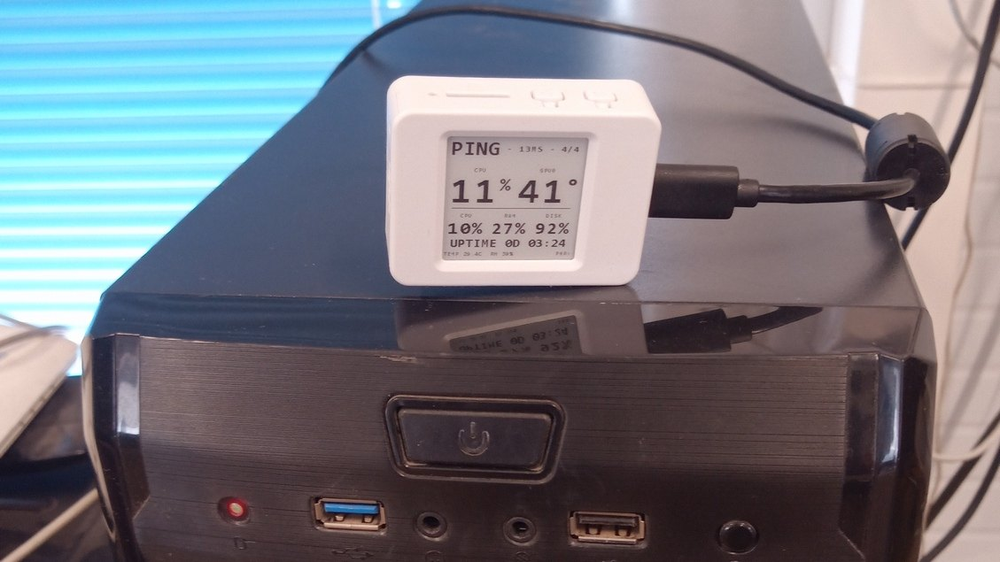
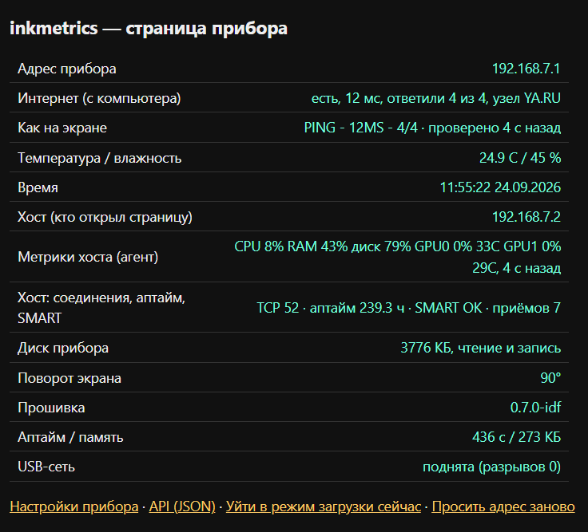
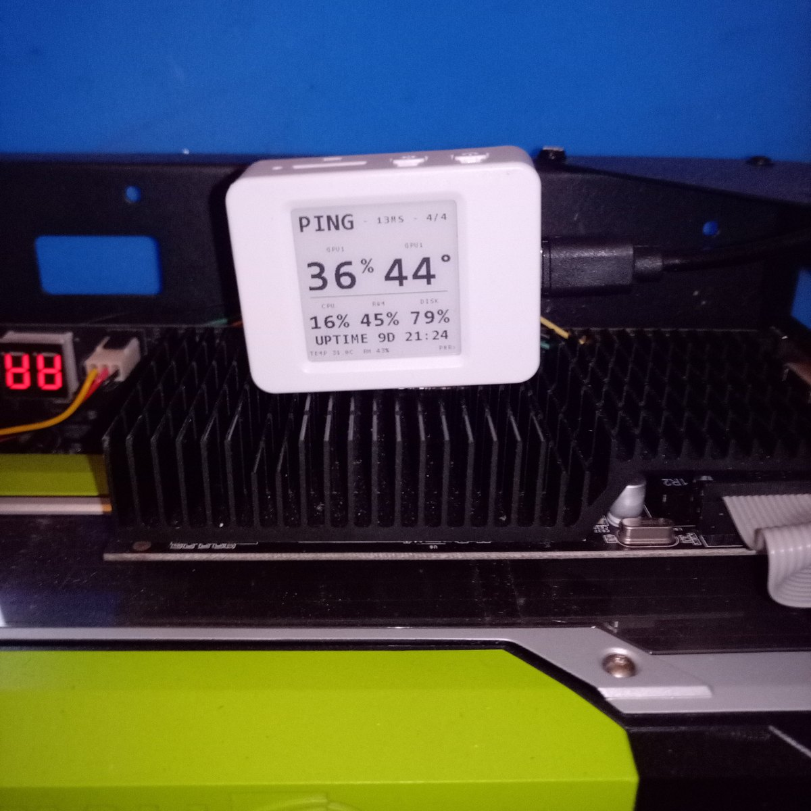
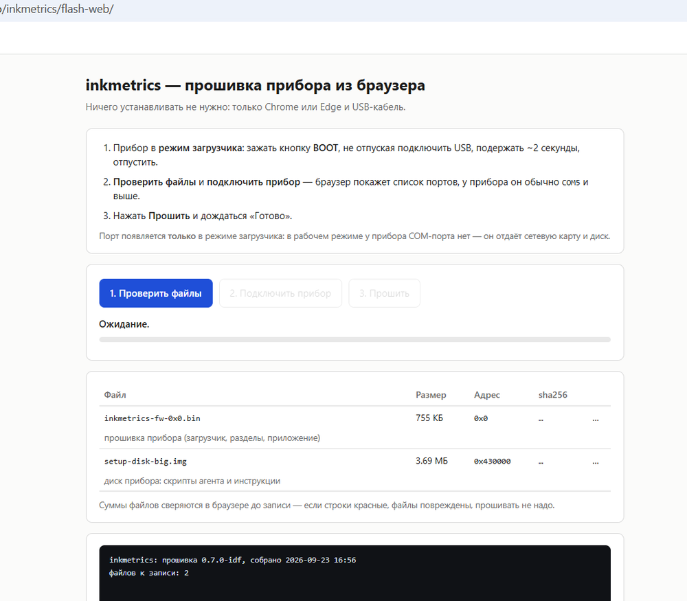
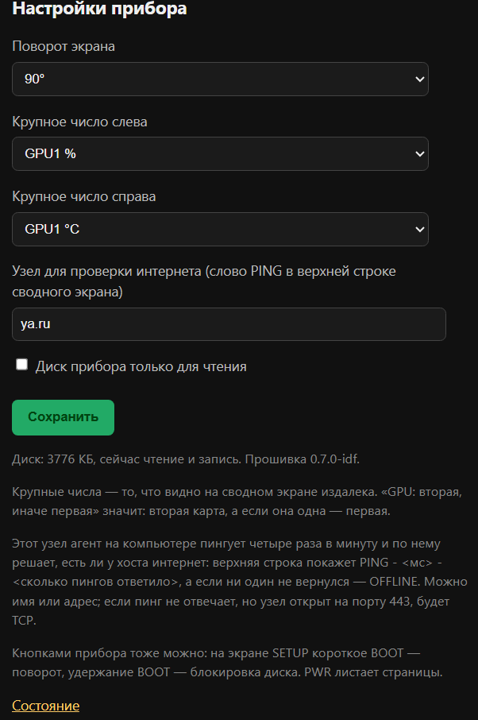
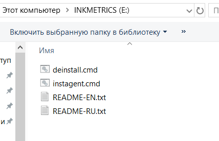
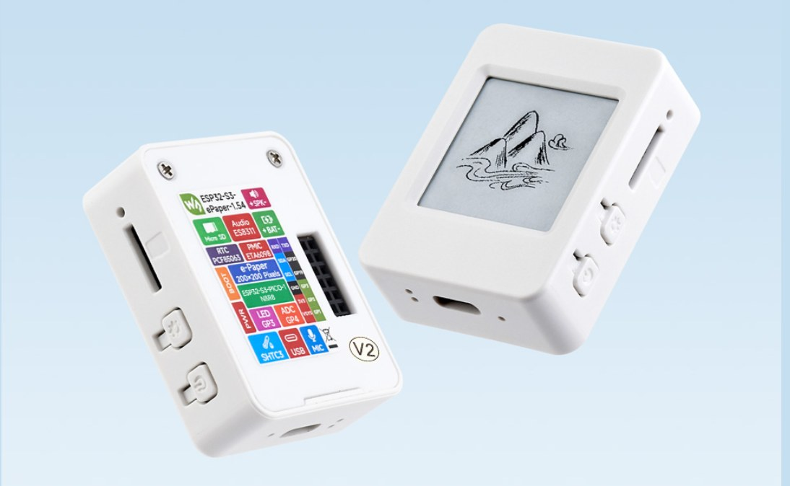
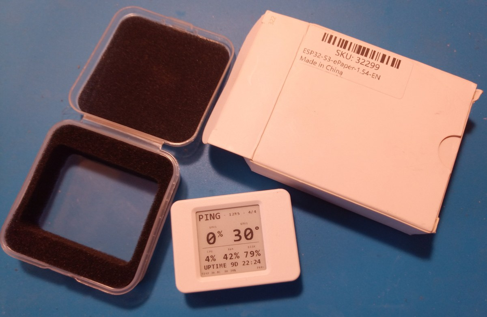

# inkmetrics

**Русский** · [English](README.en.md)



Настольное табло на **ESP32-S3 с e-ink панелью 200×200** для компьютера и домашнего сервера: загрузка
CPU, памяти и диска, загрузка и температуры видеокарт, аптайм, состояние SMART и есть ли интернет.

Связь — **один USB-кабель**. Прибор отдаётся хосту составным USB-устройством (сетевая карта RNDIS +
флешка), экран рисует сам, своими шрифтами, а компьютер раз в минуту отправляет только цифры —
плоский JSON на `POST /ingest` по адресу `192.168.7.1`. Ни Wi-Fi, ни драйверов, ни интернета прибору
не нужно.

История проекта и все подробности — в статье на Хабре:
**[«Монитор на e-ink для сервера за выходные»](https://habr.com/ru/articles/1085984/)**.

## Зачем это

Сервер с двумя Tesla P100 греется и гудит на кухне, а знать от него нужно три вещи: не ушла ли
температура видеокарты к порогу троттлинга, сколько занято памяти и не кончилось ли место на SSD.
Отсюда и раскладка: два крупных числа — это почти всегда температуры карт, остальное мелкими
строками.

## Что показывает прибор

| Что на экране | Откуда берётся |
|---|---|
| Загрузка CPU, память, диск, аптайм | штатные счётчики Windows, агент раз в минуту |
| Загрузка и температуры видеокарт | `nvidia-smi`, а где его нет — счётчики WDDM, те же, что в диспетчере задач |
| Состояние диска | SMART: `OK` / `WARNING` / `UNHEALTHY` |
| Интернет компьютера | пинг: `PING - 16MS - 4/4`, `PING - <мс>MS - TCP` (ICMP молчит, но 443 открыт), `OFFLINE - 0/4` |
| Актуальность данных | молчание агента дольше 90 секунд стирает числа в прочерки `--`, в строке интернета — `NO DATA` |



Экранов два, короткое нажатие PWR переключает их. Сводный собран так: сверху строка про интернет
компьютера, ниже два крупных числа, под ними проценты CPU, RAM и DISK, аптайм и датчик. Экран SETUP
показывает адрес веб-кабинета, что стоит в крупных числах, поворот, режим диска, узел проверки
интернета и версию прошивки. Кнопки: PWR коротко — переключить экран, удержание — перерисовать кадр;
на SETUP короткое нажатие BOOT поворачивает панель на 90°, удержание блокирует запись на диск
прибора.

## Как это устроено (и почему именно так)

* **Экран рисует прибор, а не компьютер.** В первой редакции кадр 200×200 собирал ПК: Pillow, шрифт
  Consolas, 5000 байт по COM-порту, плата только принимала готовый буфер. Переделано потому, что у
  картинки с компьютера нет второго экрана, настроек из браузера и состояния «данных нет», а любая
  правка вида тянула за собой правку генератора картинки. Сейчас раскладка живёт в прошивке, шрифты
  генерируются (`tools/make_font.py`), а на компьютере остался тупой сборщик цифр.
* **ESP-IDF, а не Arduino.** На Arduino-ядре USB-сеть невозможна: TinyUSB там собран без сетевого
  класса. Ради того, чтобы прибор сам отдавал страницу, проект переехал на ESP-IDF.
* **Драйверы не нужны.** У ESP32-S3 системный USB: Windows сама поднимает и сетевую карту, и диск с
  файлами агента. Но адаптеру прибора нельзя давать шлюз — иначе Windows уводит туда маршрут по
  умолчанию и интернет на компьютере пропадает.
* **Проценты чужих видеокарт — через WDDM.** На машинах без `nvidia-smi` загрузка берётся из
  счётчиков `\GPU Engine(*)\Utilization Percentage`, тех же, что показывает диспетчер задач;
  адаптеры различаются по LUID, порядок карт — по объёму видеопамяти, чтобы нулевой была дискретная.
  Этим путём получаются только проценты: температура и память чужой карты остаются прочерком, а не
  красивым нулём.
* **Правило кегля выведено замером, а не на глаз.** Оба крупных числа не длиннее двух знаков —
  печатаются крупным шрифтом; если хоть одно трёхзначное, оба уходят в средний. Крупным «100%»
  занимает 124 пикселя из 200, два таких не влезают.
* **Флешка перестала быть «дискетой».** Сначала на диске прибора было 2880 секторов — ровно 1,44 МБ,
  как у дискеты, и Windows по размеру выбирала класс SFloppy: в Проводнике появлялась буква `A:` и
  «Дискета». Диск вырос до 3,7 МБ, теперь это обычный том `INKMETRICS`.



## Прошить прибор (3 шага)

Нужен только Python 3 и `esptool` — ни ESP-IDF, ни Arduino IDE, ни интернета прибору не надо.

```bat
pip install esptool

rem 1) прибор в режим загрузчика: зажать BOOT, подключить USB, подержать ~2 с, отпустить
rem 2) залить прошивку и диск одним запуском (свой порт вместо COM5)
flash-kit\idf\flash.bat COM5
```

Порт можно посмотреть командой `python -m serial.tools.list_ports -v`. `flash.bat` пишет
загрузчик, таблицу разделов, прошивку и образ диска — и в конце сам снимает флаг загрузчика,
чтобы прибор запустился без передёргивания USB.

Дальше прибор поднимается сам: на экране — сводка метрик, в Проводнике — диск `INKMETRICS`
(3,69 МБ) и сетевой адаптер с адресом `192.168.7.1`. С диска запускается `instagent.cmd`
(см. «Агент на ПК» ниже). Подробности лежат рядом в `flash-kit/idf/START-HERE.txt`.

**Если что-то пошло не так**

| Симптом | Что делать |
|---|---|
| `esptool not found` | `pip install esptool` |
| `Could not open COM5`, порт не виден | Отключить и подключить USB; порт может смениться — посмотреть список заново |
| Прибор не запустился после заливки (пустой экран, нет диска и сети) | Отключить и подключить USB: прибор стартует в обычном режиме |
| Диск виден, `instagent.cmd` не ставится | Запускать от имени администратора |
| Прибор через ~5 минут пропал (нет ни диска, ни сети) | Так работает самопроверка: при молчании хоста 5 минут прибор уходит в режим загрузки. Залейте комплект заново или отключите-подключите USB |

## Прошить без установки — прямо из браузера

Прошивальщик открывается в Chrome или Edge: **<https://isemaster.github.io/inkmetrics/flash-web/>** —
ничего скачивать и ставить не нужно, страница сама берёт образы и заливает их по USB.



1. Прибор в режим загрузчика: зажать **BOOT**, подключить USB, подержать ~2 секунды, отпустить.
2. **«Проверить файлы»** — страница сама сверит sha256 образов, затем **«Подключить прибор»** и
   выбрать порт (у прибора обычно `COM5` и выше).
3. **«Прошить»** — записываются прошивка и диск прибора, страница сама перезагружает прибор в
   рабочий режим.

Тот же прошивальщик есть в репозитории (`flash-web/index.html` — открывать через любой локальный
веб-сервер из корня репозитория: `python -m http.server 8765`, затем
`http://localhost:8765/flash-web/`; двойным щелчком он не годится, потому что тянет образы из
соседней папки) и одним файлом в архиве релиза (`inkmetrics-webflash-*.zip`: распаковать и открыть
`inkmetrics-webflash.html` — образы вшиты внутрь, интернет не нужен).

> **Честно про проверку.** Страница открывается и сверяет суммы, находит прибор и открывает порт —
> но **саму запись завершить на нашей плате не удалось**, и мы не пишем «работает», пока не проверили.
> Причина не в странице: загрузчик ESP32-S3 здесь — USB-Serial/JTAG, и дёргание линий DTR/RTS
> укладывает его порт до передёргивания USB (воспроизводится обычным `esptool` из командной строки).
> Если у вас так же — прошивайте комплектом из раздела выше: его команды линии DTR/RTS не дёргают
> вообще.

## Страница прибора в браузере

Ставить ничего не надо: страницы живут на самом приборе по адресу `192.168.7.1`.

* **`/`** — состояние: адрес прибора, есть ли интернет у компьютера и что видно на экране,
  температура и влажность с датчика SHTC3, время, кто открыл страницу, метрики хоста, температуры и
  память карт, аптайм и TCP-соединения, SMART, размер диска прибора, поворот, версия прошивки. Там же
  ссылки «уйти в режим загрузчика» и «прошить адрес заново».
* **`/setup`** — настройки: поворот экрана, два крупных числа (что показывать слева и справа), узел
  проверки интернета, блокировка записи на диск прибора. Настройки лежат в NVS и переживают
  перепрошивку.



## Агент на ПК



1. Скопировать `agent-kit/` (или один файл `instagent.cmd` с флешки прибора) на компьютер.
2. Запустить `instagent.cmd` **от администратора**: агент ляжет в `C:\ProgramData\inkmetrics`,
   задача планировщика «inkmetrics agent» будет запускать его каждую минуту от SYSTEM.
3. Проверить: `C:\ProgramData\inkmetrics\agent.log` — раз в минуту строка вида
   `sent ok (cpu=8.4%, ping YA.RU 16ms 4/4)`.
4. Удаление — `deinstall.cmd` (снимает задачу, процесс и папку).

Ни Python, ни драйверов, ни служб: агент — один файл `.cmd` с кодом внутри. Узел для проверки
интернета задаётся на странице прибора `/setup` и раздаётся агентам с прибора.

## Что лежит в репозитории

| Папка | Что это |
|---|---|
| `idf/` | прошивка (ESP-IDF 5.5): экран, страницы прибора, настройки, диск, USB-дескрипторы |
| `agent-kit/` | агент для ПК: `instagent.cmd` и `deinstall.cmd` (код агента внутри файлов) + инструкции RU/EN |
| `flash-kit/` | готовый комплект для заливки на другом компьютере: `idf/flash.bat`, образы, `START-HERE.txt`, копии скриптов агента |
| `flash-web/` | веб-прошивальщик: страница для Chrome/Edge, которая заливает прибор по USB без установки чего-либо |
| `media/` | картинки для этого README (прибор, страницы прибора, веб-прошивальщик) |
| `tools/` | сборка и генераторы: шрифты, образ диска, комплект для переноса, стенд макета экрана, диагностика |
| `docs/` | протокол обмена, распиновка, адресация, раскладка экрана, заметки по выпуску |

В репозиторий не попадают (см. `.gitignore`): каталоги сборки, скачанные компоненты IDF,
образ диска-источник `firmware/media/*.img` (готовая копия лежит в комплекте), архивы
`flash-kit-*.zip` и рабочие заметки проекта (`MEMORY.md`, `ISSUES.md`, `NEXT-SESSION.md`).

## Собрать из исходников (кто правит код)

Нужен **ESP-IDF 5.5** (команда `idf.py`). Порядок такой:

```bash
idf.py -C idf build              # прошивка → idf/build/inkmetrics_idf.bin
python tools/make_setup_disk.py  # образ диска прибора: скрипты агента и инструкции (FAT)
python tools/make_flash_kit.py   # комплект flash-kit/: образы, flash.bat, START-HERE.txt
```

Раскладка экрана правится не «на глаз»: сначала макет на стенде (`tools/preview`), потом
прошивка. Смена раскладки или кегля шрифта — повод поднять версию в `idf/main/main.c`.

Заливка в разработке: `python tools/try_flash.py idf/build` — ждёт порт, пишет прошивку с
диском и сам снимает флаг загрузчика (прибор можно увести в загрузчик запросом
`GET /api/boot`, кнопку BOOT нажимать не нужно).

## Частые вопросы

* **Нужна ли Arduino IDE?** Нет. Прошивка собрана на ESP-IDF и заливается комплектом
  (`flash.bat`) через `esptool`: ни Arduino IDE, ни пакета плат `esp32`, ни библиотек панели
  ставить не нужно. Arduino-ветка была в ранних версиях проекта и убрана — она работала через
  COM-порт и не умела того, что умеет текущая (USB-сеть и приём метрик от агента).
* **Нужен ли прибору интернет?** Нет. Связь и питание — один USB-кабель; интернет нужен только
  для того, чтобы показывать, есть ли он у компьютера (пинг).
* **Нужны ли драйверы?** Нет: у ESP32-S3 системный USB, Windows сама поднимет и сетевую карту,
  и диск с файлами агента.
* **Можно ли перепрошить, не нажимая BOOT?** Да, если прибор уже работает: `GET /api/boot`
  (страница прибора) или `python tools/try_flash.py idf/build`.
* **Если Python ставить не хочется?** Готовый комплект заливается и без Python: прошивальщик
  **Flash Download Tool** от Espressif — файл `flash-kit/idf/inkmetrics-fw-0x0.bin` записывается
  с адреса `0x0`, образ диска `setup-disk-big.img` — с адреса `0x430000`. Всё то же самое, что
  делает `flash.bat`, только кнопками.
* **Как поправить раскладку экрана?** Сначала макетом на стенде (`tools/preview`), потом сборка
  и заливка — «Собрать из исходников» выше.

## Как это делалось

Прибор написан за выходные и доехал до версии 0.7.1. Код писал агент (Hermes), а человек ставил
задачи, ругался на результат и проверял на железе: **18 часов** работы над прошивкой, двенадцать
сессий, 75 подходов, 4767 сообщений, 2407 вызовов инструментов. Локальный Qwen3-27B прочитал
2,1 миллиона входных токенов и написал всего 168 тысяч — он больше читал, чем сочинял (стек паники,
исходники IDF, логи), так что платить за это не пришлось ни разу, только электричество.

Петля разработки была почти без рук: прибор висел на USB у рабочего компьютера, агент сам заливал
прошивку (`GET /api/boot` уводит прибор в загрузчик, `tools/try_flash.py` пишет и снимает флаг
загрузчика), счётчик загрузок в «чёрном ящике» перевалил за тысячу в первые сутки, а кнопку BOOT
человек нажимал в лучшем случае раз пять. Кабель дёргали только когда порт USB умирал после опытов
с режимами загрузчика.

## Чего ещё нет

* обновления прошивки по воздуху — хотя место под второй слот в разделе уже есть: приложение
  занимает 642 КБ из 3,2 МБ, а рядом лежит мегабайт под копию;
* точки доступа Wi-Fi, чтобы смотреть показания с телефона;
* корпуса — плата лежит на подставке как есть.

## Железо

Waveshare **ESP32-S3-ePaper-1.54** (панель 200×200), датчик температуры и влажности SHTC3,
питание и связь — USB. Распиновка и адресация: `docs/pins.md`, `docs/addressing.md`.

## Документация

* `docs/protocol.md` — протокол `POST /ingest` и поля метрик;
* `docs/screens-v7.md` + `docs/screens-v7.png` — раскладка обоих экранов и кегли шрифтов;
* `docs/slots-2026-09-23.md` — настраиваемые крупные числа (два слота на странице `/setup`);
* `docs/release-0.7.0.md`, `docs/release-0.7.1.md` — выпуски: состав артефактов и проверки;
* `docs/notify-plan.md` — черновик: вывод произвольного текста от устройств умного дома;
* `idf/README.md` — сборка, диагностика, разбор паник, работа с «чёрным ящиком».

## Что купить (готовое)

Собирать ничего не нужно: плата с панелью продаётся готовой — Waveshare **ESP32-S3-ePaper-1.54**
(вариант `-EN`, SKU 32299) в белом корпусе, с экраном, кнопками, датчиком SHTC3 и USB-разъёмом.
Прибор — это та же плата плюс наша прошивка; из железа больше ничего не нужно, кроме USB-кабеля и
компьютера.



Легенда на плате перечисляет всё, что на ней стоит: ESP32-S3-PICO-1-N8R8, панель e-Paper 200×200,
RTC PCF85063, аудиокодек ES8311, микрофон, SHTC3, USB и три кнопки. Прошивка использует панель,
кнопки, SHTC3 и USB.



Так выглядит посылка: коробка `ESP32-S3-ePaper-1.54-EN`, панель в пакетиках с поролоном — и прибор
на столе, уже с нашей прошивкой. Покупать нужно только железо: прошивка и агент бесплатны для личного
использования (см. «Лицензия»).

## Лицензия

Код проекта распространяется по лицензии **PolyForm Noncommercial 1.0.0** — официальный текст в файле
`LICENSE`, оригинал: <https://polyformproject.org/licenses/noncommercial/1.0.0>.

Коротко и по-русски (это пояснение, оно не заменяет английский текст):

* **Для себя — свободно и бесплатно.** Личное использование, хобби, обучение, эксперименты, правки под
  свои нужды, бесплатная передача копий другим людям. Программное обеспечение даётся «как есть»,
  без гарантий.
* **Для продажи — нужно разрешение.** Коммерческое использование (продажа приборов с этой прошивкой,
  продажа прошивки или комплекта, применение в платном продукте или услуге) лицензией не разрешено.
  Условия обсуждаются отдельно — напишите на **isemaster+inkmetrics@gmail.com** (подробнее: `COMMERCIAL.md`).
* **Что передавать вместе с копией.** Текст лицензии (или ссылку на него) и строку уведомления:
  `Required Notice: Copyright isemaster (https://github.com/isemaster/inkmetrics)`.
* **Чужие компоненты** (ESP-IDF, TinyUSB, esptool-js, драйвер панели, шрифты) остаются под своими
  условиями — см. `THIRD-PARTY-NOTICES.md`; наша лицензия их не перекрывает.
